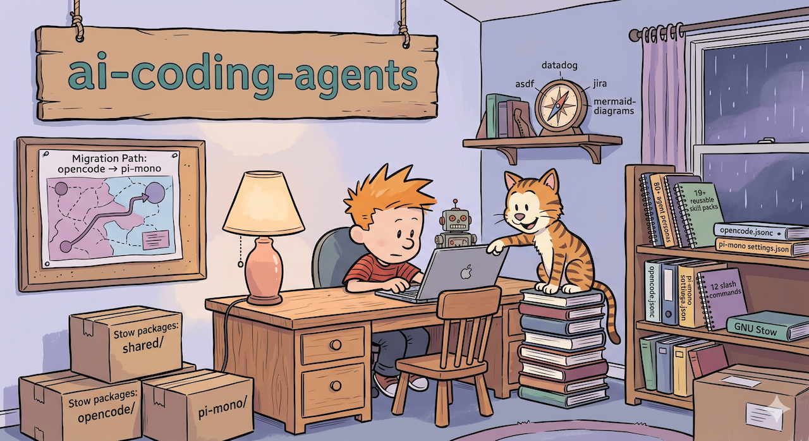

<div align="center">
  <h1>ai-coding-agents</h1>
  
  <p><strong>Personal AI agent configuration managed with GNU Stow — shared across opencode and pi-mono.</strong></p>
</div>

<p align="center">
  <a href="https://github.com/jjmartres/ai-coding-agents">
    
  </a>
  <a href="https://github.com/jjmartres/ai-coding-agents/issues">
    
  </a>
</p>

---

> **Migration notice**
>
> I am migrating from **opencode** to **pi-mono**. This repository replaces
> [jjmartres/opencode](https://github.com/jjmartres/opencode), which is now
> archived and read-only. During the transition both agent tools are supported
> here. This is the long-term home for all shared agent configuration going
> forward.

---

## Table of Contents

- [What this repo is](#what-this-repo-is)
- [Prerequisites](#prerequisites)
- [Repository structure](#repository-structure)
- [Stow packages](#stow-packages)
- [Installation](#installation)
- [Make targets](#make-targets)
- [Pre-commit hooks](#pre-commit-hooks)
- [Development](#development)
- [Troubleshooting](#troubleshooting)

## What this repo is

Three [GNU Stow](https://www.gnu.org/software/stow/) packages, all targeting
`$HOME`, that deploy:

- **80+ agent persona files** shared between opencode and pi-mono
- **19 reusable skill packs** covering diagrams, code review, Jira, Datadog, and more
- **12 slash commands** for common workflows (commit, review, test, …)
- **opencode-specific** configuration: `opencode.jsonc`, MCP servers, themes, plugins
- **pi-mono-specific** configuration: settings, models, TypeScript extensions

## Prerequisites

| Tool | Purpose | Required |
|------|---------|----------|
| [GNU Stow](https://www.gnu.org/software/stow/) | Symlink farm manager | Yes |
| [opencode](https://opencode.ai) | AI coding agent | If using the `opencode` package |
| [pi-mono](https://github.com/mariozechner/pi) | AI coding agent | If using the `pi-mono` package |
| [Node.js](https://nodejs.org/) v18+ | JSONC validation script | Yes |
| [TypeScript](https://www.typescriptlang.org/) | pi-mono extension typechecking | Yes (`npm install -g typescript`) |
| [pre-commit](https://pre-commit.com/) | Git hook framework | Optional |

**macOS:**

```bash
brew install stow node pre-commit
npm install -g typescript
```

## Repository structure

```
ai-coding-agents/
├── shared/                          # Stow package 1 — shared across both agents
│   └── .ai-agents/
│       ├── agents/                  # 80+ agent persona .md files
│       │   ├── 00-general/
│       │   ├── 01-core/
│       │   ├── 02-languages/
│       │   ├── 03-infrastructure/
│       │   ├── 04-quality-and-security/
│       │   ├── 05-data-ai/
│       │   ├── 06-developer-experience/
│       │   ├── 07-specialized-domains/
│       │   ├── 08-business-product/
│       │   ├── 09-meta-orchestration/
│       │   └── 10-curiosity/
│       ├── commands/                # Shared slash commands
│       │   ├── commit.md
│       │   ├── commit-and-create-mr.md
│       │   ├── datadog.md
│       │   ├── documentation.md
│       │   ├── review.md
│       │   ├── sync-branch.md
│       │   ├── test.md
│       │   └── ...
│       ├── rules/
│       │   └── memory-bank.md
│       └── skills/                  # Reusable skill packs
│           ├── asdf/
│           ├── code-docs/
│           ├── datadog/
│           ├── glab/
│           ├── httpie/
│           ├── humanizer/
│           ├── jira/
│           ├── marp-slide/
│           ├── mcp-builder/
│           ├── mermaid-diagrams/
│           ├── project-docs/
│           ├── worktrunk/
│           ├── writing-clearly-and-concisely/
│           └── ...
│
├── opencode/                        # Stow package 2 — opencode-specific
│   └── .config/opencode/
│       ├── opencode.jsonc
│       ├── cost-guard.config.jsonc
│       ├── tui.jsonc
│       ├── plugins/
│       └── themes/                  # Catppuccin variants
│
├── pi-mono/                         # Stow package 3 — pi-mono-specific
│   └── .pi/agent/
│       ├── settings.json
│       ├── models.json
│       ├── auth.json
│       ├── themes/
│       └── extensions/              # TypeScript extensions
│           ├── agents.ts
│           ├── aliases.ts
│           ├── git-checkpoint.ts
│           ├── permission-gate.ts
│           ├── piline.ts
│           ├── protected-paths.ts
│           ├── rules.ts
│           ├── sessions-management.ts
│           ├── skills-searcher.ts
│           ├── skills.ts
│           ├── tps.ts
│           └── usage.ts
│
├── scripts/
│   └── validate-jsonc.js
├── .pre-commit-config.yaml
├── .stowrc
└── Makefile
```

## Stow packages

### `shared/` → `~/.ai-agents/`

Contains everything that both opencode and pi-mono consume: agent personas,
skill packs, slash commands, and rules. Stow maps the contents of
`shared/` directly into `$HOME`, so `shared/.ai-agents/` lands at
`~/.ai-agents/`.

### `opencode/` → `~/.config/opencode/`

opencode application config: main `opencode.jsonc`, cost-guard settings,
TUI theme preferences, plugins, and Catppuccin UI themes.

**Agents symlink (not managed by Stow)**

opencode expects its agent files at `~/.config/opencode/agents/`. Stow cannot
deliver the same source directory to two different destinations, so `make
install` creates this symlink separately:

```
~/.config/opencode/agents  →  ~/.ai-agents/agents
```

Run `make link-agents` to create it on its own. See `make status` to verify it.

### `pi-mono/` → `~/.pi/`

pi-mono application config: settings, model definitions, auth, themes, and a
set of TypeScript extensions that add custom behaviour (agent loading, skill
search, session management, git checkpoints, usage tracking, and more).

## Installation

```bash
# Clone
git clone https://github.com/jjmartres/ai-coding-agents.git
cd ai-coding-agents

# Stow all packages and create the agents symlink
make install

# (Optional) Install pre-commit hooks
make install-hooks
```

After install, symlinks under `$HOME` point back into this repo. Edit files
here; changes take effect immediately.

## Make targets

```
Installation
  install              Stow all packages + create agents symlink
  stow-install         Stow all packages only
  link-agents          Create ~/.config/opencode/agents symlink only
  uninstall            Remove agents symlink + unstow all packages
  restow               Re-run stow (use after adding/removing files)

Utilities
  check                Verify setup (directories, stow binary, .stowrc)
  status               Show linked packages and agents symlink state
  clean                Remove broken symlinks under ~/.ai-agents and ~/.config/opencode

Pre-commit hooks
  install-hooks        Install pre-commit hooks
  uninstall-hooks      Remove pre-commit hooks
  run-hooks            Run all hooks against all files
  update-hooks         Update hooks to latest versions
```

## Pre-commit hooks

| Hook | What it checks |
|------|---------------|
| `check-stowrc-exists` | `.stowrc` is present |
| `validate-makefile` | Makefile parses without syntax errors |
| `typecheck-extensions` | pi-mono TypeScript extensions pass `tsc --noEmit` |
| `validate-jsonc` | All `.jsonc` files are valid JSON-with-comments |
| `trailing-whitespace` | No trailing whitespace |
| `end-of-file-fixer` | Files end with a newline |
| `check-yaml` | YAML files are valid |
| `check-json` | JSON files (non-JSONC) are valid |
| `check-added-large-files` | No files larger than 1 MB |
| `check-merge-conflict` | No leftover conflict markers |
| `detect-private-key` | No accidental private key commits |
| `mixed-line-ending` | Enforces LF line endings |
| `markdownlint` | Markdown in `shared/` passes `.markdownlint.yaml` |
| `shellcheck` | Shell scripts pass `shellcheck --severity=warning` |

## Development

### Adding an agent

Create a `.md` file in the appropriate category under
`shared/.ai-agents/agents/`. No re-stowing needed — the directory is already
symlinked.

### Adding a skill

Create a subdirectory under `shared/.ai-agents/skills/` with a `SKILL.md`
entry point. Same as agents: no re-stowing needed.

### Adding or removing files in a stow package

After adding or deleting files in `opencode/` or `pi-mono/`:

```bash
make restow
```

### Running hooks manually

```bash
make run-hooks

# Or target a single hook
pre-commit run typecheck-extensions --all-files
pre-commit run markdownlint --all-files
```

### Updating configuration

```bash
git pull origin main
make restow
```

## Troubleshooting

**Symlinks not created / stow conflicts**

```bash
make status          # check what's linked
make clean           # remove broken symlinks
make uninstall
make install
```

**Agents not loading in opencode**

```bash
# Verify the extra symlink exists
ls -la ~/.config/opencode/agents

# Recreate it if missing
make link-agents
```

**TypeScript typecheck fails**

```bash
# Ensure tsc is available
npm install -g typescript

# Run the check manually
pre-commit run typecheck-extensions --all-files
```

**JSONC validation fails**

```bash
# Ensure Node.js >= 18 is installed
node --version

# Run the check manually
pre-commit run validate-jsonc --all-files
```

---

MIT License — see [LICENSE](LICENSE).
