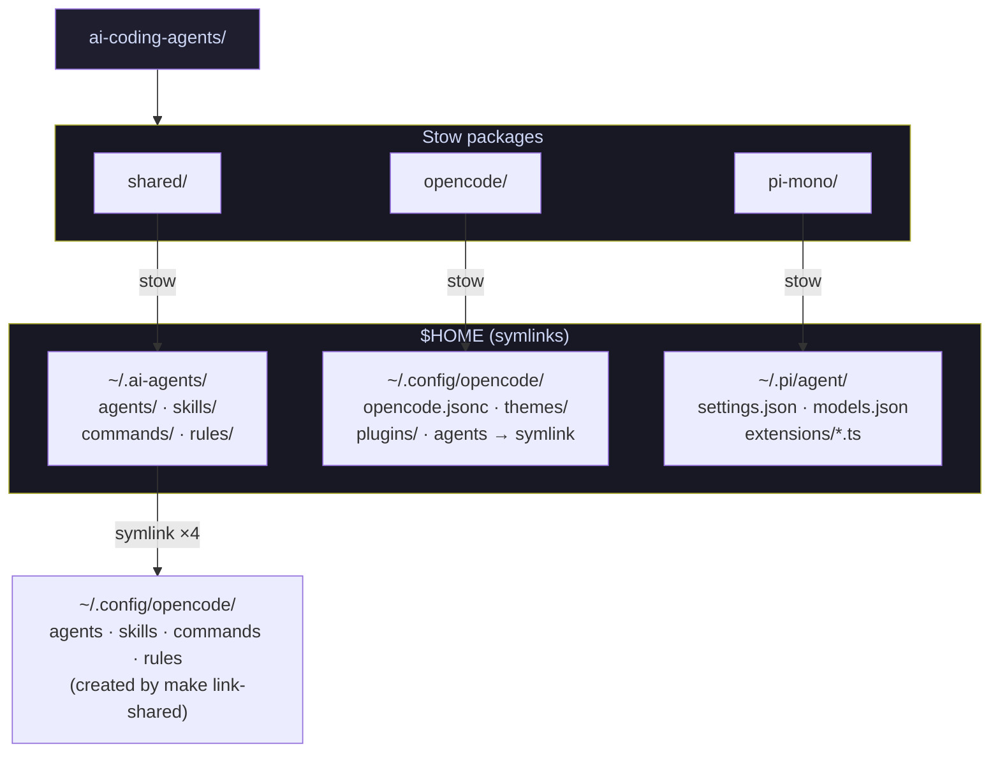
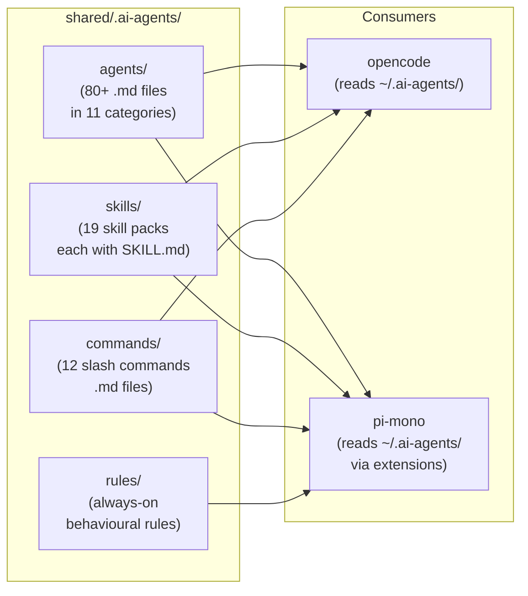
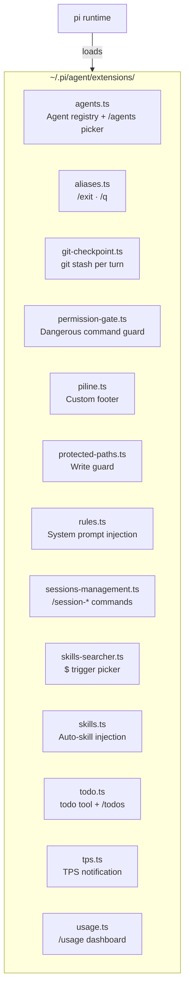
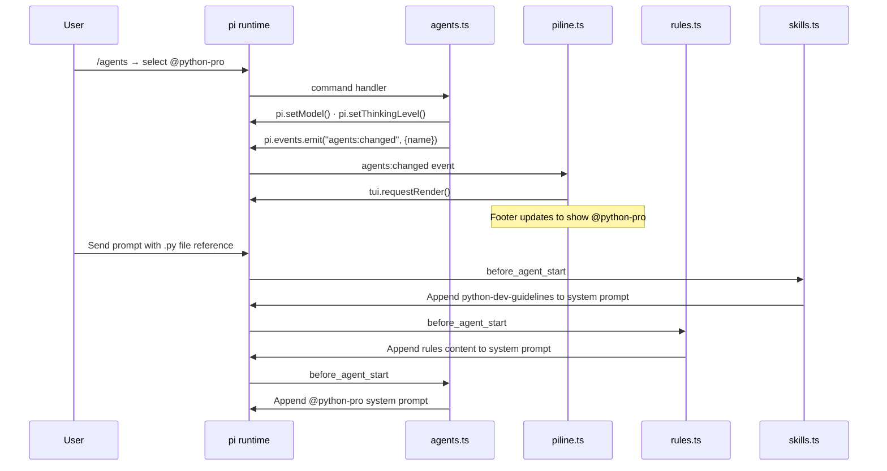

# Architecture

[← Back to README](../README.md)

This document describes the structure of `ai-coding-agents`, how the three Stow packages are deployed to `$HOME`, and how the pi-mono extensions interact at runtime.

## Table of contents

- [Repository layout](#repository-layout)
- [Stow deployment model](#stow-deployment-model)
- [Shared package structure](#shared-package-structure)
- [Pi-mono extensions](#pi-mono-extensions)
- [Extension interaction map](#extension-interaction-map)
- [Memory bank location](#memory-bank-location)

---

## Repository layout

The repository contains three independent [GNU Stow](https://www.gnu.org/software/stow/) packages. Each package mirrors the directory structure under `$HOME`, so `stow <package>` creates the corresponding symlinks.

```
ai-coding-agents/
├── shared/          # → $HOME  (agents, skills, commands, rules)
├── opencode/        # → $HOME  (opencode-specific config and themes)
├── pi-mono/         # → $HOME  (pi settings and TypeScript extensions)
├── scripts/         # Utility scripts (JSONC validator)
├── docs/            # Project documentation
├── Makefile
└── .pre-commit-config.yaml
```

---

## Stow deployment model



`make install` runs `stow` for all three packages and then creates four
symlinks under `~/.config/opencode/` pointing to `~/.ai-agents/` (agents,
skills, commands, rules), because Stow cannot map the same source directory to
two different destinations. Use `make link-shared` to create these symlinks
independently.

---

## Shared package structure

The `shared/` package provides everything that both opencode and pi-mono consume:
agents, skills, commands, and rules.



### Agent categories

Agents are organised into 11 numbered directories under `agents/`. The prefix
controls display order in the picker:

| Directory | Domain |
|-----------|--------|
| `00-general/` | General-purpose and communication |
| `01-core/` | Backend, API, fullstack, microservices |
| `02-languages/` | Language-specific experts (Python, Go, TS, …) |
| `03-infrastructure/` | DevOps, Kubernetes, cloud, SRE |
| `04-quality-and-security/` | QA, code review, penetration testing |
| `05-data-ai/` | Data engineering, ML, LLM architecture |
| `06-developer-experience/` | DX, CLI, build, documentation |
| `07-specialized-domains/` | Fintech, blockchain, music, payments |
| `08-business-product/` | Product, legal, UX, marketing |
| `09-meta-orchestration/` | Multi-agent coordination and context |
| `10-curiosity/` | Research, trend analysis, market intelligence |

---

## Pi-mono extensions

Extensions in `pi-mono/.pi/agent/extensions/` are TypeScript files loaded
automatically by pi on startup. Each file exports a default function that
receives the `ExtensionAPI` and registers hooks, commands, and tools.



---

## Extension interaction map

Some extensions communicate with each other rather than operating in isolation.
The primary coupling is between `agents.ts` and `piline.ts` via the event bus.



### Event bus usage

| Event emitted | Source | Consumers |
|---------------|--------|-----------|
| `agents:changed` | `agents.ts` | `piline.ts` |

All other inter-extension communication happens through pi's built-in lifecycle
events (`session_start`, `turn_start`, `before_agent_start`, `tool_call`, etc.).

---

## Memory bank location

The memory bank rule (`shared/.ai-agents/rules/memory-bank.md`) stores session
context in `.ai-agents/memory-bank/` inside the project root. If a legacy
`.opencode/memory-bank/` directory is found, the rule migrates it automatically.

```
<project-root>/
└── .ai-agents/
    └── memory-bank/
        ├── projectbrief.md      # Core requirements and goals
        ├── productContext.md    # Why the project exists
        ├── activeContext.md     # Current focus and next steps
        ├── systemPatterns.md    # Architecture and design decisions
        ├── techContext.md       # Technologies, constraints, dependencies
        └── progress.md          # Status, known issues, decision history
```

The files build on each other in a defined hierarchy — `projectbrief.md` is
the foundation; `progress.md` and `activeContext.md` change most frequently.
